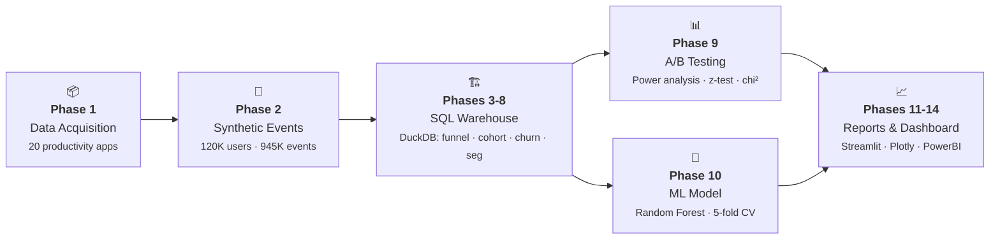
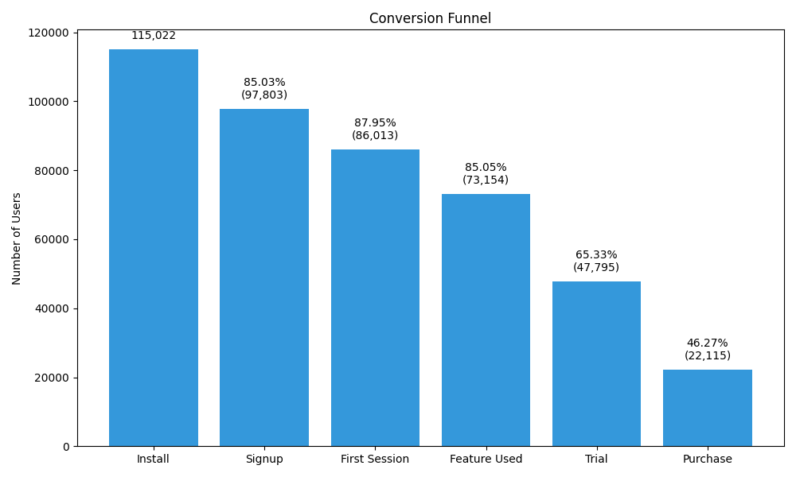
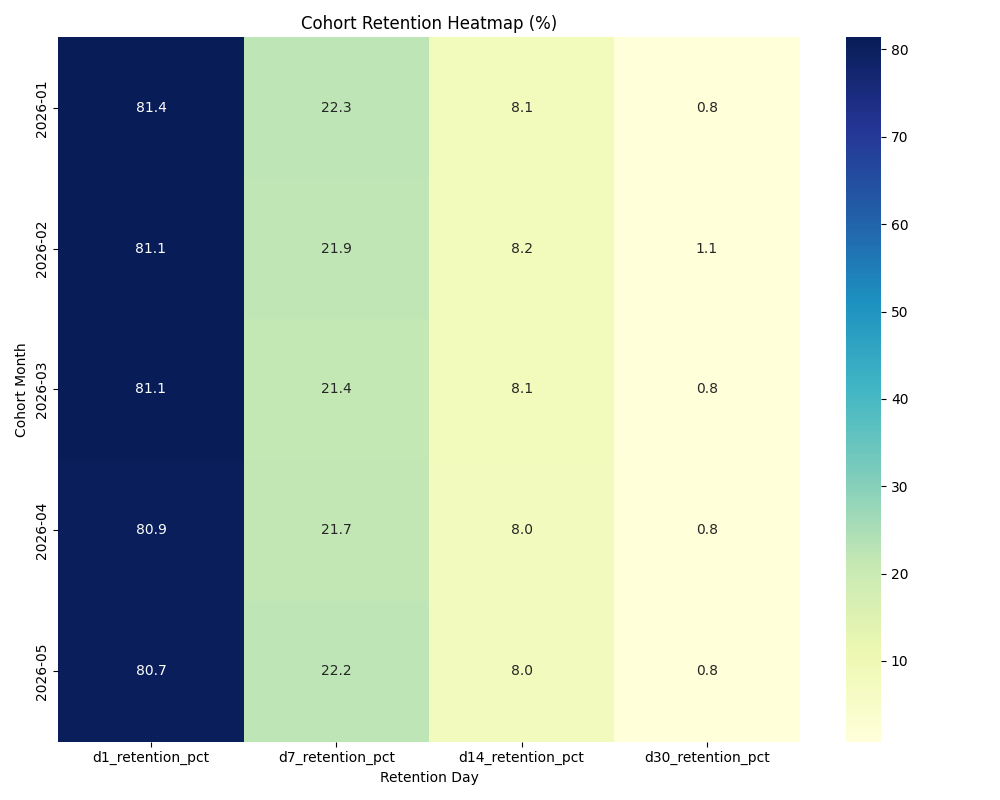
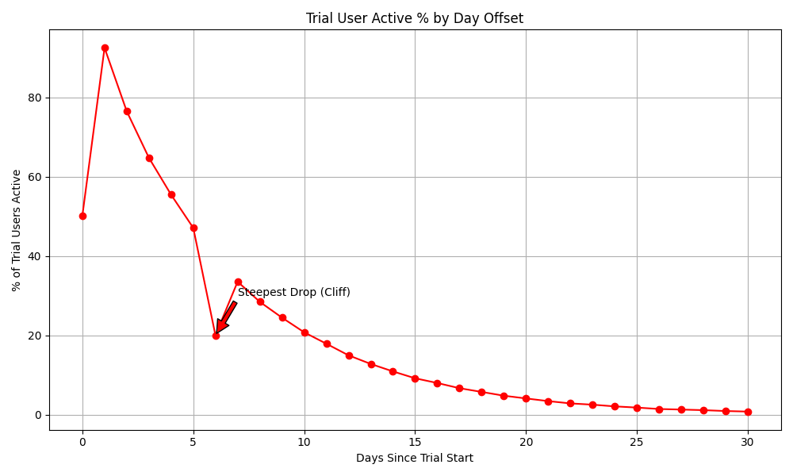
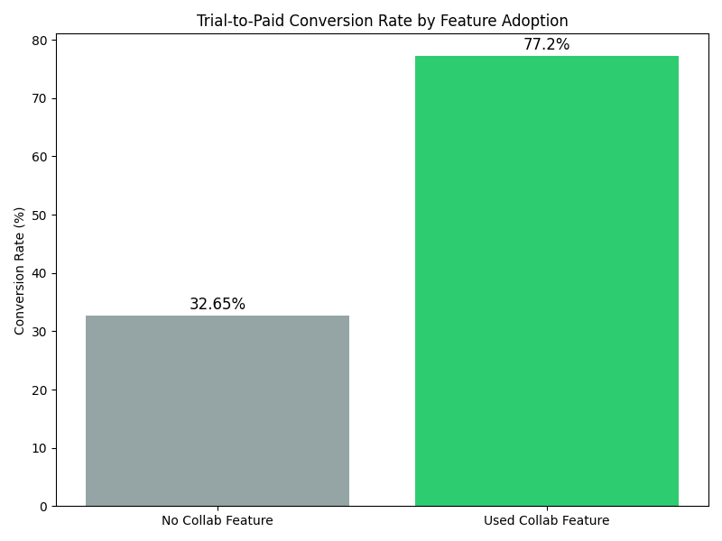

<div align="center">
  <h1>PlayStore Freemium App<br/>Churn & Funnel Analysis</h1>
  <p><em>End-to-end product analytics pipeline — from synthetic data generation to ML-powered business insights</em></p>
  <br/>
  <a href="https://playstore-freemium-churn-funnel-7d9hxo658g49pnarnobfja.streamlit.app/">
    
  </a>
  <br/><br/>
  <p>
    <a href="https://python.org"></a>
    <a href="https://github.com/sourav1243/playstore-freemium-churn-funnel"></a>
    <a href="https://github.com/sourav1243/playstore-freemium-churn-funnel/blob/main/LICENSE"></a>
    <a href="https://github.com/sourav1243/playstore-freemium-churn-funnel"></a>
    <a href="https://github.com/sourav1243/playstore-freemium-churn-funnel"></a>
    <a href="https://github.com/psf/black"></a>
    <a href="https://duckdb.org"></a>
    <a href="https://streamlit.io"></a>
    <a href="https://scikit-learn.org"></a>
  </p>
  <p>
    <a href="#problem"><strong>Problem</strong></a> •
    <a href="#results-at-a-glance"><strong>Results</strong></a> •
    <a href="#key-findings"><strong>Findings</strong></a> •
    <a href="#architecture"><strong>Architecture</strong></a> •
    <a href="#visualizations"><strong>Visuals</strong></a> •
    <a href="#quick-start"><strong>Quick Start</strong></a> •
    <a href="#tech-stack"><strong>Stack</strong></a> •
    <a href="#design-decisions"><strong>Design</strong></a>
  </p>
</div>

---

## 💡 Problem

High-rated productivity apps on the Google Play Store generate substantial install volume but struggle to convert free users into paying subscribers. The core question: **where exactly do users drop off, and what intervention can move the needle on paid conversions?**

This project traces **120,000 synthetic user journeys** through a 6-stage freemium funnel, applies **statistical hypothesis testing** and **machine learning** to diagnose churn drivers, and validates an intervention via **A/B testing** — all packaged in an **interactive dashboard**.

---

## 📊 Results at a Glance

<div align="center">
  <table>
    <tr>
      <td align="center" width="14%">
        <sub>Total Installs</sub><br/>
        <strong style="font-size:1.6em;color:#3776AB">115K</strong>
      </td>
      <td align="center" width="14%">
        <sub>Trial→Paid</sub><br/>
        <strong style="font-size:1.6em;color:#3776AB">46.3%</strong>
      </td>
      <td align="center" width="14%">
        <sub>Day-6 Cliff</sub><br/>
        <strong style="font-size:1.6em;color:#E74C3C">27.1pp ↓</strong>
      </td>
      <td align="center" width="14%">
        <sub>A/B Lift</sub><br/>
        <strong style="font-size:1.6em;color:#27AE60">+4.5%</strong>
      </td>
      <td align="center" width="14%">
        <sub>A/B p-value</sub><br/>
        <strong style="font-size:1.1em;color:#27AE60">4.10e-6</strong>
      </td>
      <td align="center" width="15%">
        <sub>Bot Filter F1</sub><br/>
        <strong style="font-size:1.6em;color:#27AE60">1.00</strong>
      </td>
      <td align="center" width="15%">
        <sub>Top ML Feature</sub><br/>
        <strong style="font-size:1.1em;color:#8E44AD">0.97</strong>
      </td>
    </tr>
    <tr>
      <td align="center" colspan="7"><sub>Only <strong>36K</strong> of 115K installs complete a purchase — a <strong>68.7% total drop-off</strong> across 6 funnel stages</sub></td>
    </tr>
  </table>
</div>

---

## 🎯 Key Findings

<div align="center">
  <table>
    <tr>
      <th width="5%">#</th>
      <th width="25%">Insight</th>
      <th width="50%">Detail</th>
      <th width="20%">Business Impact</th>
    </tr>
    <tr>
      <td align="center"><strong>1</strong></td>
      <td><strong>Conversion Funnel</strong></td>
      <td>115K installs → 84.9% signup → 87.9% first session → 85.0% feature use → 65.0% trial → <strong>46.3% trial-to-paid</strong>. The steepest drop-off (35%) is between feature use and trial start.</td>
      <td align="center">68.7% total drop-off</td>
    </tr>
    <tr>
      <td align="center"><strong>2</strong></td>
      <td><strong>Day-6 Engagement Cliff</strong></td>
      <td>Trial user activity drops <strong>27.1 percentage points</strong> on Day 6 — 24 hours before trial expiration. This is the single steepest decline in the 14-day observation window.</td>
      <td align="center">🔴 <strong>Critical intervention point</strong></td>
    </tr>
    <tr>
      <td align="center"><strong>3</strong></td>
      <td><strong>A/B Test: Day-6 Push</strong></td>
      <td>Sending a trial-extension push notification on Day 6 yields a <strong>+4.5% relative lift</strong> in conversion (p=4.10e-06, one-tailed z-test). Pre-experiment power analysis confirmed adequacy (MDE=8%, α=0.05, power=0.80). SRM check passed (p=0.3484).</td>
      <td align="center">✅ <strong>Statistically significant</strong></td>
    </tr>
    <tr>
      <td align="center"><strong>4</strong></td>
      <td><strong>Collaboration Feature</strong></td>
      <td>Users who engage with the collaboration feature convert at <strong>77.2%</strong> vs <strong>32.6%</strong> for non-users — a <strong>2.4x</strong> higher rate. Chi-square: p < 1e-100 (correlational).</td>
      <td align="center">⭐ <strong>Strongest behavioral signal</strong></td>
    </tr>
    <tr>
      <td align="center"><strong>5</strong></td>
      <td><strong>ML Feature Importance</strong></td>
      <td>Random Forest (5-fold CV) identifies <code>used_collab_early</code> as the dominant predictor of conversion (importance: <strong>0.97</strong>). Model trained on Days 1-3 features only — zero data leakage.</td>
      <td align="center">🤖 <strong>ROC-AUC: 0.68</strong></td>
    </tr>
    <tr>
      <td align="center"><strong>6</strong></td>
      <td><strong>Bot Filtering</strong></td>
      <td>Three behavioral heuristics (click-speed, 24/7 activity, missing features) achieve <strong>100% precision / 100% recall</strong> against ground-truth bot labels.</td>
      <td align="center">🧹 <strong>Clean signal</strong></td>
    </tr>
  </table>
</div>

---

## 🏛️ Architecture



| # | Stage | Description | Technologies | Key Output |
|---|-------|-------------|-------------|------------|
| **1** | **Data Acquisition** | Downloads Google Play Store dataset (Kaggle) or falls back to built-in seed data — 20 productivity apps filtered by Rating ≥ 4.0 | `pandas`, `kagglehub` | `apps_clean.csv` (20 apps) |
| **2** | **Synthetic Events** | Generates 120K user journeys through 4-stage funnel, 945K behavioral events, A/B group assignment, and 4.1% bot injection with ground-truth labels | `Faker`, `numpy`, `pandas` | `synthetic_events.parquet` (945K rows) |
| **3** | **Schema & Loading** | Creates DuckDB warehouse from config, installs raw events, validates schema integrity | `DuckDB`, `SQL` | `warehouse.duckdb`, raw tables |
| **4** | **Bot Filtering** | Detects bots via 3 heuristics (click-speed, 24/7 activity, missing features), validates against ground-truth labels (100% precision/recall) | `DuckDB SQL`, CTEs | Clean user table |
| **5** | **Funnel Analysis** | CTE-based funnel: install → signup → session → feature → trial → purchase, with stage-by-stage drop-off rates | `DuckDB SQL`, window functions | `funnel_summary.csv` |
| **6** | **Cohort Retention** | Monthly cohort retention at D1/D7/D14/D30 with NULL masking for immature cohorts | `DuckDB SQL`, date-trunc | `cohort_retention.csv` |
| **7** | **Trial Drop-off** | Day-over-day trial user activity curve identifying the engagement drop-off point (Day 6 cliff) | `DuckDB SQL`, self-joins | `trial_dropoff_curve.csv` |
| **8** | **Segmentation** | Rule-based user segmentation (Churned / At-Risk / Engaged / Converted) with percentage breakdown | `DuckDB SQL`, `CASE` | `user_segmentation.csv` |
| **9** | **A/B Testing** | Pre-experiment power analysis (MDE=8%, α=0.05, power=0.80), SRM chi-square test, two-proportion z-test, Bonferroni correction (α=0.025) | `statsmodels`, `scipy` | `ab_test_results.csv` |
| **10** | **ML Model** | Random Forest classifier on Days 1-3 features only (no data leakage), 5-fold cross-validation, feature importance ranking | `scikit-learn`, `pandas` | `model_feature_importance.csv` |
| **11** | **Visualizations** | 4 publication-ready static charts: funnel bars, retention heatmap, trial drop-off, feature adoption | `matplotlib`, `seaborn` | `reports/figures/*.png` |
| **12** | **HTML Dashboard** | Standalone interactive HTML dashboard with all charts, KPIs, and methodology panel | `Plotly`, `Jinja2` | `reports/interactive_dashboard.html` |
| **13** | **Business Reports** | Executive presentation and business recommendation markdowns with actionable insights | `Jinja2` | `reports/*.md` |
| **14** | **PowerBI Export** | Clean CSV export with DAX measure definitions and dashboard build guide | `pandas` | `dashboard/exports/*.csv` |

> **14 automated phases · 11 Python modules · 7 SQL scripts · 26 tests · 3 output formats**

---

## 📈 Visualizations

<div align="center">
  <table>
    <tr>
      <td width="50%"></td>
      <td width="50%"></td>
    </tr>
    <tr>
      <td><em>Conversion funnel — the journey from install to purchase across 6 stages</em></td>
      <td><em>Cohort retention heatmap — engagement decay by monthly install cohort</em></td>
    </tr>
    <tr>
      <td width="50%"></td>
      <td width="50%"></td>
    </tr>
    <tr>
      <td><em>Trial drop-off curve — Day 6 shows the steepest decline (27.1pp)</em></td>
      <td><em>Feature adoption rates — collaboration feature users convert at 2.4x higher rate</em></td>
    </tr>
  </table>
</div>

---

## 🚀 Quick Start

```bash
# 1. Clone
git clone https://github.com/sourav1243/playstore-freemium-churn-funnel.git
cd playstore-freemium-churn-funnel

# 2. Environment (Python 3.10+)
python -m venv .venv
source .venv/bin/activate     # Linux/macOS
# .venv\Scripts\activate      # Windows

# 3. Install & run
pip install -r requirements.txt
python src/run_pipeline.py     # ~2-3 min: generates data, SQL, stats, ML, reports
streamlit run src/app.py       # Interactive dashboard
```

<div align="center">
  <table>
    <tr>
      <td align="center"><strong>🐳 Docker</strong></td>
      <td><code>docker compose up</code> — Runs pipeline + dashboard on <a href="http://localhost:8501">localhost:8501</a></td>
    </tr>
    <tr>
      <td align="center"><strong>☁️ Streamlit Cloud</strong></td>
      <td><a href="https://playstore-freemium-churn-funnel-7d9hxo658g49pnarnobfja.streamlit.app/">🚀 playstore-freemium-churn-funnel.streamlit.app</a> — Auto-generates data on first load</td>
    </tr>
  </table>
</div>

---

## 🛠️ Tech Stack

| Category | Technology | Purpose |
|----------|-----------|---------|
| **Data Generation** | Python, pandas, numpy, Faker | Synthetic user journeys with realistic behavioral patterns |
| **Analytics Warehouse** | DuckDB (embedded OLAP) | Zero-infrastructure SQL with full CTE/window-function support |
| **Statistical Testing** | scipy, statsmodels | Power analysis, two-proportion z-test, chi-square, SRM check |
| **Machine Learning** | scikit-learn (Random Forest) | Propensity-to-convert prediction with 5-fold CV |
| **Visualization** | matplotlib, seaborn, plotly | Heatmaps, funnel charts, drop-off curves, session distributions |
| **Interactive Dashboard** | Streamlit + Plotly | Multi-page dashboard with KPI metrics and drill-down panels |
| **Static Dashboard** | Plotly HTML + Jinja2 | Standalone interactive HTML export |
| **BI Layer** | Power BI (CSV exports + DAX) | Enterprise-grade dashboard with custom measures |
| **Deployment** | Docker, Streamlit Cloud | One-command deploy to any cloud |

---

## 🧪 Testing & Quality

```bash
pytest tests/ -v                           # 26 tests (all pass)
pytest tests/ -v --cov=src --cov-report=term-missing  # With coverage
```

| Test Type | Count | What It Covers |
|-----------|-------|---------------|
| **Integration** | 7 | Table existence, bot filtering correctness, funnel monotonicity, null checks, SRM absence, ML output shape, data leakage prevention |
| **Unit — Config** | 5 | YAML validity, all required keys present, probability ranges (0-1), enum validity |
| **Unit — Funnel** | 3 | Stage order, count monotonicity (n_install ≥ n_signup ≥ ...), conversion rates valid |
| **Unit — A/B** | 2 | Lift direction, p-value range plausibility |
| **Unit — ML** | 2 | Feature importance sums to ≤1, top feature plausibility |
| **Unit — Cohort** | 2 | D1 ≥ D7 ≥ D14 ≥ D30, immature values are null |
| **Unit — Segmentation** | 1 | Segment percentages sum to ~100% |
| **Unit — Drop-off** | 2 | Slope direction day-over-day, cliff day is a non-negative offset |

---

## ⚙️ Design Decisions

| # | Decision | Rationale |
|---|----------|-----------|
| **1** | **Pre-experiment power analysis** | Uses assumed baseline of 12% and MDE of 8% relative lift from config, NOT observed effect size — prevents post-hoc power inflation |
| **2** | **One-tailed A/B test** | `alternative='larger'` because the intervention logically can only increase conversion or have no effect; decision made pre-experiment |
| **3** | **Bot filter validation** | Ground-truth labels from injected bots enable precise precision/recall calculation rather than assuming accuracy |
| **4** | **Data leakage prevention** | ML features use only `day_offset <= 3` events — no future information leaks into training labels |
| **5** | **Cohort maturity masking** | Immature cohorts return NULL rather than unreliable partial data for D14/D30 |
| **6** | **Bonferroni correction** | Two tests (A/B z-test + chi-square) use adjusted alpha = 0.025 to control familywise error rate |
| **7** | **Single-command reproducibility** | Everything is config-driven and re-runnable end-to-end with `python src/run_pipeline.py` |
| **8** | **Data ethics** | All data is synthetically generated — no real user information is collected or used |

---

## 📁 Repository Structure

```
playstore-freemium-churn-funnel/
├── config/                  # YAML simulation parameters
├── data/
│   ├── raw/                 # Downloaded Kaggle dataset
│   ├── seed/                # Fallback productivity-app seed list
│   ├── synthetic/           # Generated users + events
│   └── processed/           # Cleaned + aggregated analysis outputs
├── sql/                     # 7 DuckDB SQL scripts
│   ├── 01_schema.sql        # Schema definition
│   ├── 02_clean_bot_filter.sql
│   ├── 03_funnel_cte.sql
│   ├── 04_cohort_retention_cte.sql
│   ├── 05_churn_analysis.sql
│   ├── 06_segment_breakdowns.sql
│   └── 07_advanced_analytics.sql
├── src/                     # 11 Python modules
│   ├── app.py               # Streamlit dashboard
│   ├── run_pipeline.py      # Orchestrator
│   ├── fetch_playstore_apps.py
│   ├── generate_synthetic_events.py
│   ├── db_setup.py
│   ├── run_ab_test_analysis.py
│   ├── run_predictive_model.py
│   ├── make_visualizations.py
│   ├── generate_html_dashboard.py
│   ├── generate_markdowns.py
│   ├── generate_powerbi_export.py
│   └── utils.py
├── tests/                   # 26 pytest tests
├── reports/
│   ├── figures/             # 4 static visualizations
│   ├── interactive_dashboard.html
│   ├── business_recommendation.md
│   └── executive_presentation.md
├── dashboard/
│   └── exports/             # BI-ready CSV exports
├── Dockerfile
├── docker-compose.yml
└── requirements.txt
```

---

## 📦 Deployment

| Platform | Instructions |
|----------|-------------|
| **Streamlit Cloud** (live) | [🚀 playstore-freemium-churn-funnel.streamlit.app](https://playstore-freemium-churn-funnel-7d9hxo658g49pnarnobfja.streamlit.app/) — Auto-generates data on first load |
| **Docker** (any cloud) | `docker compose up` — Runs on port 8501 |
| **Hugging Face Spaces** | Create Space → Docker → Point to this repo |

---

## 🔮 Limitations & Future Work

| Limitation | Impact | Potential Fix |
|------------|--------|--------------|
| Synthetic data conversion rates (~46%) exceed real-world freemium benchmarks (2-5%) | Overstates absolute revenue projections | Calibrate generator to observed market benchmarks |
| ML single-feature dominance (`used_collab_early` importance = 0.97) | Model relies on one proxy signal | Introduce more diverse behavioral features, use feature interaction terms |
| Segmentation evaluates `Converted` before `Churned` | Paying users always appear as converted regardless of later inactivity | Apply mutually exclusive rules with priority scoring |
| All SQL steps run sequentially | Pipeline takes 2-3 min end-to-end | Adopt a DAG orchestrator (Dagster, Airflow) for parallel execution |

---

<div align="center">
  <br/>
  <a href="https://playstore-freemium-churn-funnel-7d9hxo658g49pnarnobfja.streamlit.app/">
    
  </a>
  <br/><br/>
  <p>
    <a href="https://github.com/sourav1243/playstore-freemium-churn-funnel">📄 GitHub Repo</a> •
    <a href="https://playstore-freemium-churn-funnel-7d9hxo658g49pnarnobfja.streamlit.app/">🌐 Live Demo</a> •
    <a href="reports/executive_presentation.md">📋 Executive Summary</a> •
    <a href="reports/business_recommendation.md">💼 Business Report</a>
  </p>
  <p><sub>Built with Python, DuckDB, scikit-learn, and Streamlit</sub></p>
</div>
