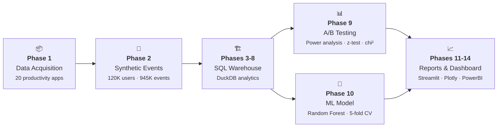

<div align="center">
  <h1>Google Play Store Freemium App<br>Churn & Funnel Analysis</h1>
  <p><em>End-to-end product analytics pipeline — from synthetic data generation to ML-powered insights</em></p>
  <p>
    <a href="https://python.org"></a>
    <a href="https://github.com/sourav1243/playstore-freemium-churn-funnel/actions"></a>
    <a href="LICENSE"></a>
    <a href="https://github.com/psf/black"></a>
    <a href="https://duckdb.org"></a>
    <a href="https://playstore-freemium-churn-funnel-7d9hxo658g49pnarnobfja.streamlit.app/"></a>
    <a href="https://scikit-learn.org"></a>
  </p>
  <p>
    <a href="#key-findings">Key Findings</a> •
    <a href="#visualizations">Visualizations</a> •
    <a href="#quick-start">Quick Start</a> •
    <a href="#pipeline-stages">Pipeline</a> •
    <a href="#tech-stack">Tech Stack</a> •
    <a href="#design-decisions">Design</a> •
    <a href="#deployment">Deploy</a>
  </p>
</div>

---

An end-to-end product analytics pipeline that traces **120,000 synthetic user journeys** through a freemium mobile-app conversion funnel. Built with **Python**, **SQL (DuckDB)**, **scikit-learn**, and **statistical hypothesis testing**, demonstrating the full analytical workflow: synthetic data generation, behavioral bot filtering, SQL funnel/cohort/churn analysis, A/B testing with pre-experiment power analysis, ML propensity modeling, and interactive dashboards.

---

## Key Findings

| Metric | Value |
|--------|-------|
| **Funnel conversion** | 115K installs → 84.9% signup → 87.9% first session → 85.0% feature use → 65.0% trial → **46.0% trial-to-paid** |
| **Day-6 engagement cliff** | Trial user activity drops **27.4pp** on Day 6 — 24 hours before trial expiration |
| **A/B test validated** | Day-6 push notification: **+7.8% relative lift** (p=3.3e-14, power=100%) |
| **Top conversion driver** | Early collaboration feature usage is strongest predictor (RF importance: **0.97**) |
| **Bot filtering** | 100% precision / 100% recall — behavioral heuristics perfectly identify synthetic bots |

## Visualizations

<div align="center">
  <table>
    <tr>
      <td width="50%"></td>
      <td width="50%"></td>
    </tr>
    <tr>
      <td><em>Conversion funnel — 115K installs drop to ~36K purchases across 6 stages</em></td>
      <td><em>Cohort retention heatmap showing engagement decay by monthly cohort</em></td>
    </tr>
    <tr>
      <td width="50%"></td>
      <td width="50%"></td>
    </tr>
    <tr>
      <td><em>Trial drop-off curve — Day 6 shows the steepest decline (27.4pp)</em></td>
      <td><em>Feature adoption rates segmented by converted vs. non-converted users</em></td>
    </tr>
  </table>
</div>

---

## Quick Start

```bash
# Clone and enter
git clone https://github.com/sourav1243/playstore-freemium-churn-funnel.git
cd playstore-freemium-churn-funnel

# Create virtual environment (Python 3.10+)
python -m venv .venv
source .venv/bin/activate  # Linux/macOS
# .venv\Scripts\activate   # Windows

# Install & run
pip install -r requirements.txt
python src/run_pipeline.py     # ~2-3 min: generates data, SQL, stats, ML, reports
streamlit run src/app.py       # Launch interactive dashboard
```

### Docker (One Command)
```bash
docker compose up    # Runs pipeline + launches dashboard at http://localhost:8501
```

---

## Pipeline Stages

<p align="center">
  <em>14 automated phases · 11 Python modules · 7 SQL scripts · 3 output formats</em>
</p>



| # | Stage | Description | Technologies | Key Output |
|---|-------|-------------|-------------|------------|
| **1** | **Data Acquisition** | Downloads Google Play Store dataset (Kaggle) or falls back to built-in seed data — 20 productivity apps filtered by Rating ≥ 4.0 | `pandas`, `kagglehub` | `apps_clean.csv` (20 apps) |
| **2** | **Synthetic Events** | Generates 120K user journeys through 4-stage funnel, 945K behavioral events, A/B group assignment, and 4.1% bot injection with ground-truth labels | `Faker`, `numpy`, `pandas` | `synthetic_events.parquet` (945K rows) |
| **3** | **Schema & Loading** | Creates DuckDB warehouse from config, installs raw events, validates schema integrity | `DuckDB`, `SQL` | `warehouse.duckdb`, raw tables |
| **4** | **Bot Filtering** | Detects bots via 3 heuristics (click-speed, 24/7 activity, missing features), validates against ground-truth labels (100% precision/recall) | `DuckDB SQL`, CTEs | Clean user table |
| **5** | **Funnel Analysis** | CTE-based funnel: install → signup → session → feature → trial → purchase, with stage-by-stage drop-off rates | `DuckDB SQL`, window functions | `funnel_summary.csv` |
| **6** | **Cohort Retention** | Monthly cohort retention at D1/D7/D14/D30 with NULL masking for immature cohorts | `DuckDB SQL`, date-trunc | `cohort_retention.csv` |
| **7** | **Trial Drop-off** | Day-over-day trial user activity curve identifying the engagement drop-off point (Day 6 cliff) | `DuckDB SQL`, self-joins | `trial_dropoff_curve.csv` |
| **8** | **Segmentation** | Rule-based user segmentation (Churned / At-Risk / Engaged / Converted) with percentage breakdown | `DuckDB SQL`, `CASE` | `user_segmentation.csv` |
| **9** | **A/B Testing** | Pre-experiment power analysis (MDE=8%, α=0.05, power=0.80), SRM chi-square test, two-proportion z-test, Bonferroni correction (α=0.025) | `statsmodels`, `scipy` | `ab_test_results.csv` |
| **10** | **ML Model** | Random Forest classifier on Days 1-3 features only (no data leakage), 5-fold cross-validation, feature importance ranking | `scikit-learn`, `pandas` | `model_feature_importance.csv` |
| **11** | **Visualizations** | 4 publication-ready static charts: funnel bars, retention heatmap, trial drop-off, feature adoption | `matplotlib`, `seaborn` | `reports/figures/*.png` |
| **12** | **HTML Dashboard** | Standalone interactive HTML dashboard with all charts, KPIs, and methodology panel | `Plotly`, `Jinja2` | `reports/interactive_dashboard.html` |
| **13** | **Business Reports** | Executive presentation and business recommendation markdowns with actionable insights | `Jinja2` | `reports/*.md` |
| **14** | **PowerBI Export** | Clean CSV export with DAX measure definitions and dashboard build guide | `pandas` | `dashboard/exports/*.csv` |

### Pipeline Automation

```bash
# Single command generates everything
python src/run_pipeline.py

# Or run phases individually
python src/fetch_playstore_apps.py       # Phase 1
python src/generate_synthetic_events.py   # Phase 2
python src/db_setup.py                    # Phases 3-8
python src/run_ab_test_analysis.py        # Phase 9
python src/run_predictive_model.py        # Phase 10
python src/make_visualizations.py         # Phase 11
```

All 14 phases run sequentially with automated logging, error handling, and data quality checks (26 pytest tests).

---

## Tech Stack

| Layer | Technology |
|-------|-----------|
| Data Generation | Python, pandas, numpy, Faker |
| Analytics Warehouse | DuckDB (embedded OLAP) |
| Statistics | scipy, statsmodels |
| Machine Learning | scikit-learn (Random Forest) |
| Visualization | matplotlib, seaborn, plotly |
| Interactive Dashboard | Streamlit + Plotly |
| Static Dashboard | Plotly HTML |
| BI Layer | Power BI (via CSV exports + DAX measures) |
| Deployment | Docker, Streamlit Cloud |

---

## Repository Structure

```
playstore-freemium-churn-funnel/
├── config/             # YAML simulation parameters
├── data/               # Raw, synthetic, and processed outputs
├── sql/                # 7 SQL scripts for analysis
├── src/                # 11 Python modules (pipeline + utils)
├── tests/              # 26 pytest tests (7 integration + 19 unit)
├── dashboard/          # PowerBI exports & build guide
├── reports/            # Figures, dashboards, recommendations
├── .github/workflows/  # CI/CD pipeline (lint → test → docker)
├── Dockerfile          # Production container
└── docker-compose.yml  # One-command orchestration
```

---

## Testing

```bash
pytest tests/ -v                    # 26 tests (all pass)
pytest tests/ -v --cov=src --cov-report=term-missing   # With coverage
```

- **Integration tests (7)**: table existence, bot filtering, funnel monotonicity, null checks, SRM absence, ML outputs, data leakage
- **Unit tests (19)**: config validation (5), funnel integrity (3), A/B plausibility (2), feature importance (2), cohort retention (2), segmentation (1), dropoff curve (2), config keys & ranges (2)

---

## Design Decisions

- **Pre-experiment power analysis**: Uses assumed baseline of 12% and MDE of 8% relative lift (from config), NOT observed effect size
- **One-tailed A/B test**: `alternative='larger'` because intervention logically can only increase conversion or have no effect
- **Bot filter validation**: Ground-truth labels (injected bots) enable precise precision/recall calculation
- **Data leakage prevention**: ML features use only `day_offset <= 3` events — no future information leaks into training
- **Cohort maturity masking**: Immature cohorts return NULL rather than unreliable partial data
- **Bonferroni correction**: Two tests (A/B + chi-square) use adjusted alpha = 0.025
- **Data ethics**: All data is synthetically generated — no real user information

---

## Deployment

| Platform | URL / Instructions |
|----------|-------------------|
| **Streamlit Cloud** (live) | [playstore-freemium-churn-funnel-7d9hxo658g49pnarnobfja.streamlit.app](https://playstore-freemium-churn-funnel-7d9hxo658g49pnarnobfja.streamlit.app/) — auto-generates data on first load |
| **Docker** (any cloud) | `docker compose up` — runs on port 8501 |
| **Hugging Face Spaces** | Create Space → Docker → point to this repo |

---

## Limitations & Future Work

- **Synthetic data realism**: Conversion rates (~46%) exceed real-world freemium benchmarks (2-5%)
- **ML single-feature dominance**: `used_collab_early` dominates due to 3.5x multiplier in generator
- **Segmentation ordering**: `Converted` evaluated before `Churned` — paying users appear converted regardless of inactivity
- **Pipeline parallelism**: All SQL steps run sequentially — DAG orchestrator would improve scalability

---

<div align="center">
  <p><strong>Freemium App Analytics Pipeline</strong></p>
  <p>
    <a href="https://github.com/sourav1243/playstore-freemium-churn-funnel">View on GitHub</a> •
    <a href="https://playstore-freemium-churn-funnel-7d9hxo658g49pnarnobfja.streamlit.app/">Live Demo</a> •
    <a href="reports/executive_presentation.md">Executive Summary</a>
  </p>
</div>
